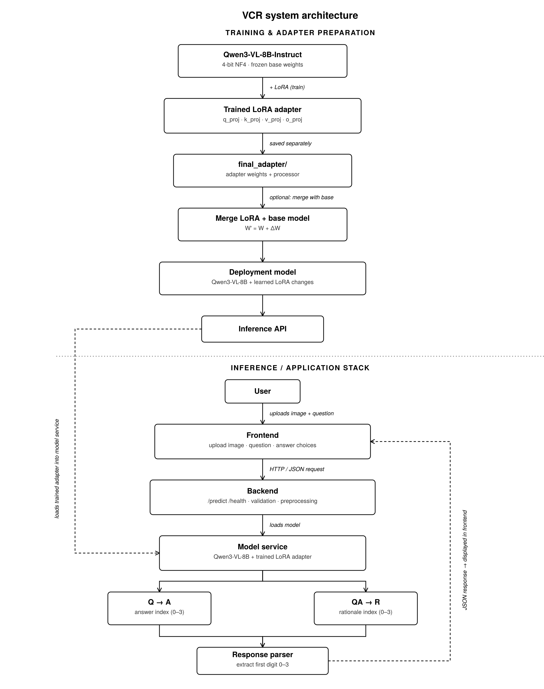
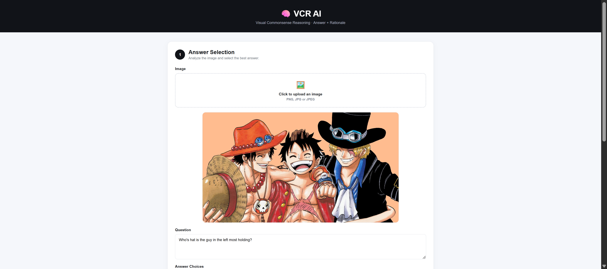

# Visual Commonsense Reasoning with Qwen3-VL

A visual reasoning pipeline for **Visual Commonsense Reasoning (VCR)** using **Qwen3-VL-8B-Instruct**, with QLoRA fine-tuning designed to run on a single **16 GB Tesla T4 GPU**.

The project investigates how much performance can be gained by improving the **visual input, prompting strategy, model scale, and fine-tuning approach** before committing to expensive training.

---

## Overview

Visual Commonsense Reasoning requires a model to understand an image, answer a multiple-choice question, and identify the rationale that best explains that answer.

This project follows a controlled experimental path:

**Visual representation → Prompting → Model selection → QLoRA → Stable training → Data scaling**

Rather than immediately fine-tuning a large vision-language model, each stage was tested independently to determine which changes actually improved performance.

The final system uses **Qwen3-VL-8B-Instruct** with a lightweight **LoRA adapter**, allowing only **3.83M parameters out of 8.77B** total parameters to be trained.

---

## Final Architecture

The final pipeline uses a shared vision-language backbone for both VCR subtasks:

* **Q → A:** Select the correct answer.
* **QA → R:** Given the question and correct answer, select the correct rationale.
* The original image is retained as the visual input.
* A reasoning-oriented prompt guides the model toward scene relationships and commonsense reasoning.
* Generation is deterministic and constrained to a single choice.

### Architecture Diagram

**[ INSERT ARCHITECTURE IMAGE HERE ]**

> Add your architecture image here, for example:
> ``

---

## Dataset

The project uses the **Rowan/VCR** dataset.

| Split      | Questions |
| ---------- | --------: |
| Training   |   212,923 |
| Validation |    26,534 |
| Test       |    25,263 |

For controlled experimentation, a **fixed seed-controlled 100-question evaluation set** was used across the early experiments. Larger training experiments were subsequently conducted using 500 and 1,000 training questions.

---

## Experiment Journey

Each notebook was designed to answer a specific question before moving to the next stage.

| Experiment               | Question                                         | Result                                 |
| ------------------------ | ------------------------------------------------ | -------------------------------------- |
| `01_visual_impact`       | Should the model use raw images, boxes or crops? | Raw images performed best              |
| `02_prompt_impact`       | Can better instructions improve reasoning?       | Guided prompt reached 64%              |
| `03_model_impact`        | Which Qwen-VL model gives the best trade-off?    | Qwen3-VL-8B reached 53% joint accuracy |
| `memory-safe v3, 100 Q`  | Is the rebuilt training loop stable?             | 40% → 41% joint accuracy               |
| `memory-safe v3, 500 Q`  | Does additional data help?                       | 50% joint accuracy                     |
| `memory-safe v3, 1000 Q` | Does scaling training further help?              | 54% joint accuracy                     |

---

## Key Findings

### 1. Raw Images Beat Visual Preprocessing

The visual ablation tested three representations:

| Input                 |  Result |
| --------------------- | ------: |
| Raw image             | **61%** |
| Object crops          |     56% |
| Bounding-box overlays |     30% |

VCR questions often depend on relationships between multiple objects. Cropping or overlaying boxes removed information that was useful for understanding the complete scene.

**Final choice: use the original image.**

### 2. Prompting Helped Before Fine-Tuning

Different prompting strategies were tested before changing the model.

| Prompt                   | Accuracy |
| ------------------------ | -------: |
| Improved / guided prompt |  **64%** |
| Reasoning prompt         |      63% |
| Baseline                 |      62% |
| Few-shot                 |      50% |

This showed that better task instructions could improve performance without increasing model size or training cost.

### 3. Larger Qwen-VL Models Improved Joint Accuracy

Model scale was also evaluated:

| Model       | Joint Accuracy |
| ----------- | -------------: |
| Qwen3-VL-2B |            33% |
| Qwen3-VL-4B |            47% |
| Qwen3-VL-8B |        **53%** |

The 8B model required more compute, but accuracy was prioritized because there was no strict latency requirement.

---

# QLoRA Fine-Tuning

The major engineering challenge was fitting an **8B vision-language model onto a 16 GB Tesla T4**.

The first fine-tuning attempt failed: the loss became `NaN`, and the resulting checkpoint collapsed to 0% accuracy.

Instead of abandoning fine-tuning, the training pipeline was rebuilt around numerical stability and recoverability.

### Stability Improvements

* Reduced learning rate from `2e-4` to `5e-5`
* Added finite-loss / NaN checks
* Added gradient clipping with maximum norm `1.0`
* Reduced LoRA rank from `8` to `4`
* Used 4-bit NF4 quantization with double quantization
* Limited image size to 336 px
* Added checkpointing after every training chunk
* Added resume-from-checkpoint support
* Added per-example OOM recovery

These changes allowed the training process to continue reliably within the available GPU memory.

---

## Final Training Configuration

| Component             | Configuration                          |
| --------------------- | -------------------------------------- |
| Backbone              | Qwen3-VL-8B-Instruct                   |
| Quantization          | 4-bit NF4 + double quantization        |
| Adapter               | LoRA                                   |
| LoRA rank             | 4                                      |
| LoRA alpha            | 8                                      |
| LoRA targets          | `q_proj`, `k_proj`, `v_proj`, `o_proj` |
| Trainable parameters  | 3,833,856                              |
| Total parameters      | 8,770,957,552                          |
| Trainable percentage  | **0.0437%**                            |
| Optimizer             | AdamW                                  |
| Weight decay          | 0.01                                   |
| Learning rate         | `5e-5`                                 |
| Gradient accumulation | 4                                      |
| Compute               | FP16                                   |
| GPU                   | Tesla T4 16 GB                         |
| Tasks                 | Q→A + QA→R                             |

---

# Results

The final evaluation was performed on a random 1,000-question sample.

| Metric       | Before QLoRA | 100Q | 500Q |   1000Q |
| ------------ | -----------: | ---: | ---: | ------: |
| Q → A        |          67% |  67% |  69% | **74%** |
| QA → R       |          65% |  65% |  72% | **77%** |
| Joint Q → AR |          40% |  41% |  50% | **54%** |

### Final Performance 
(on a 1000 question sample subset from validation dataset)

**Q → A:** 73.9%
**QA → R:** 72.1%
**Joint Q → AR:** 54.0%

The largest improvement came from rationale selection, while joint answer+rationale accuracy increased from **40% to 54%**.

---

# What I Learned

The main lesson from the project was that improving a VLM is not necessarily about immediately increasing model size or training longer.

The experiments showed that:

* The original image contained important global scene information.
* Prompt design could improve performance before any training.
* Larger VLMs provided better reasoning performance within the tested Qwen3-VL models.
* QLoRA made an 8B VLM practical on a 16 GB T4.
* Training stability was just as important as model configuration.
* Checkpointing and recovery mechanisms were essential for long experiments on limited GPU resources.
* Increasing the amount of training data produced a clear improvement in joint accuracy.

---

# Future Work

Several potentially useful extensions were intentionally left outside the final implementation because of GPU and time constraints.

### Joint Answer + Rationale Ranking

Instead of predicting the answer and rationale independently, evaluate all:

**4 answers × 4 rationales = 16 combinations**

and select the pair with the highest joint score.

### Task-Specific Adapters

Train separate LoRA adapters for:

* Q → A
* QA → R

This could allow the model to specialize for each task.

### LLM-Based Rationale Verification

A separate language model could verify whether the selected rationale actually supports the selected answer and is consistent with the image.

---

## Project Structure

```text
.
├── 01_visual_impact.ipynb
├── 02_prompt_impact.ipynb
├── 03_model_impact.ipynb
├── qlora_impact_failed.ipynb
├── qlora_impact_qwen3vl8b.ipynb
├── memory-safe_v3_100Q.ipynb
├── memory-safe_v3_500Q.ipynb
├── memory-safe_v3_1000Q.ipynb
├── README.md
└── images/
    ├── architecture.png
    ├── experiment_results.png
    └── project_demo.png
```

---

# Project Screenshots

### Architecture



### Project Interface



### Project Interface


---

## Tech Stack

* **Python**
* **PyTorch**
* **Hugging Face Transformers**
* **Qwen3-VL-8B-Instruct**
* **PEFT / LoRA**
* **BitsAndBytes / 4-bit Quantization**

---

## Conclusion

This project demonstrates a practical approach to improving visual commonsense reasoning under strict compute constraints.

Starting from zero-shot evaluation, the pipeline progressed through visual and prompt ablations, model selection, failed QLoRA training, stability improvements, and progressively larger training sets.

The final **Qwen3-VL-8B + QLoRA** system achieved **54.0% joint Q→AR accuracy**, while training only **0.0437% of the model's parameters**.

The project is therefore less about building the largest possible VLM and more about understanding **which changes actually matter when compute is limited**.
